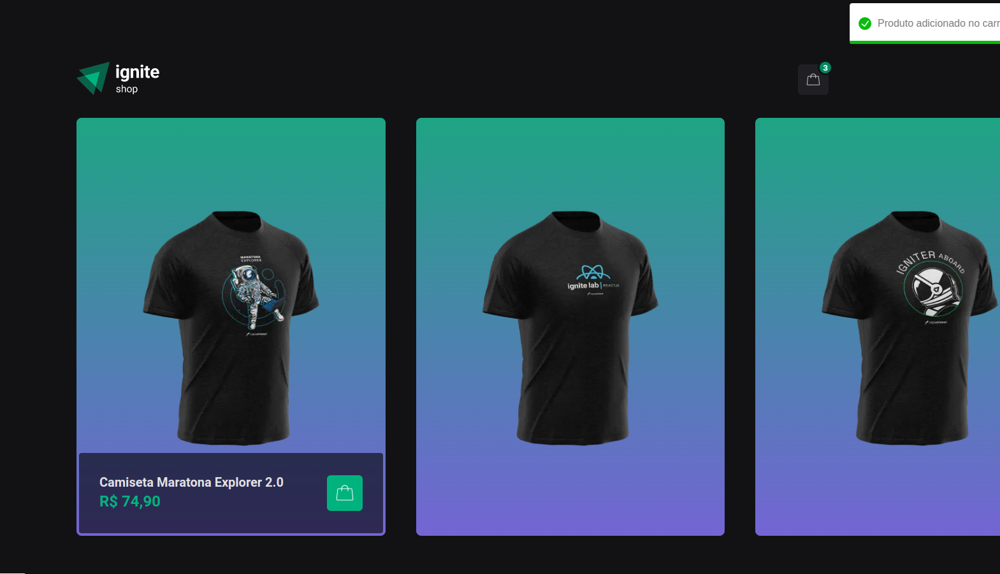
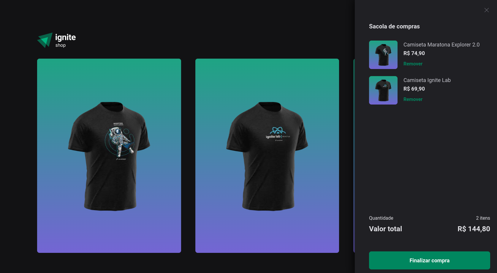

# Desafio - Ignite Shop - ignite

Desafio "Desafio: Adicionando features ao Ignite Shop" proposto pelo curso Ignite da RocketSeat, na trilha de React.JS

## Propósito do desafio

O propósito do desafio é implementar melhorias em uma aplicação SSR(SERVER SIDE RENDERING) feita em next.js

- Rotas no Next.JS
- Rotas SSG
- Integração de pagamento com o Stripe
- Uso de stiches para estilização SSG

## Aplicação

A aplicação consiste em um mini-ecommerce, com integração ao Stripe para pagamentos

## Integrações

Para a integração do stripe funcionar corretamente, é usado o .env.local com as credenciais, que ficam
seguras devido ao SERVER SIDE RENDERING, que irá executar as integrações com o node.js no lado do servidor

## Demonstração

